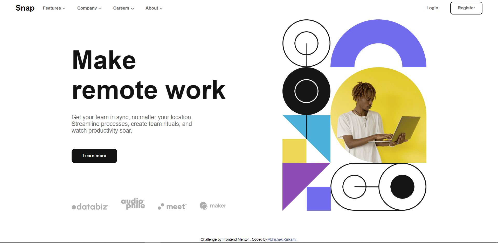

# Intro section with dropdown navigation solution

### Users should be able to:

- View the relevant dropdown menus on desktop and mobile when interacting with the navigation links
- View the optimal layout for the content depending on their device's screen size
- See hover states for all interactive elements on the page

### Screenshot

<!-- ### Links -->

<!-- - Solution URL: [Add solution URL here](https://your-solution-url.com)
- Live Site URL: [Add live site URL here](https://your-live-site-url.com) -->

### What I learned

Managing and developing website from scratch by using simple HTML, CSS, Javascript. With tools like IDE: Visual studio code and project management tool - JIRA.

## Author

- Website - [Abhishek](https://github.com/Abhi-Cool-karni/Abhishekak)
- Twitter - [@Abhishekkul2000](https://twitter.com/Abhishekkul2000)
